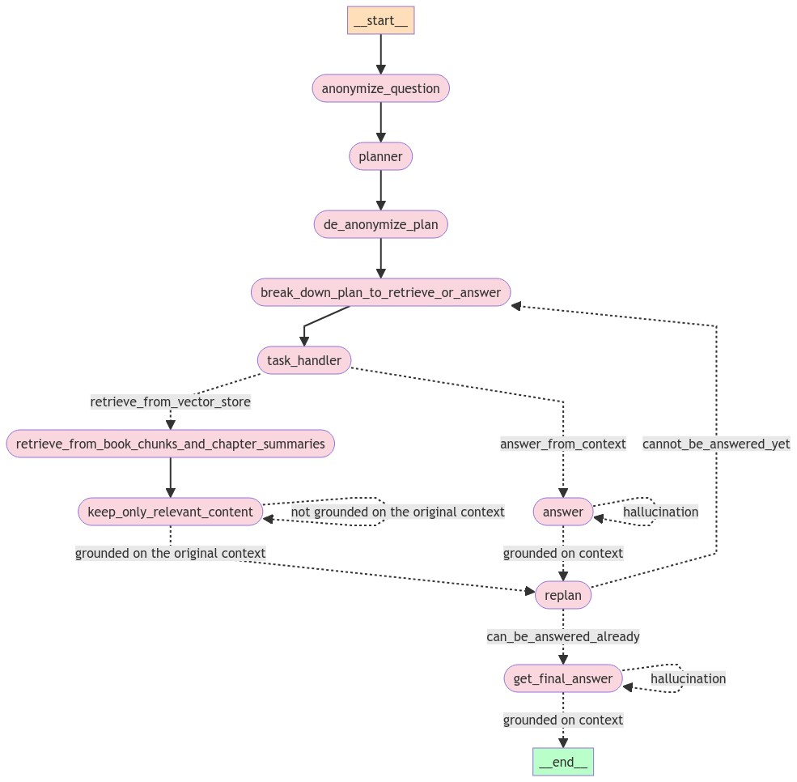

# Sophisticated Controllable Agent for Complex RAG Tasks 🧠📚

[](https://opensource.org/licenses/Apache-2.0)
[](http://makeapullrequest.com)
[](https://www.linkedin.com/in/nir-diamant-759323134/)
[](https://twitter.com/NirDiamantAI)
[](https://discord.gg/8PSA7s5v)


An advanced Retrieval-Augmented Generation (RAG) solution designed to tackle complex questions that simple semantic similarity-based retrieval cannot solve. This project showcases a sophisticated deterministic graph acting as the "brain" of a highly controllable autonomous agent capable of answering non-trivial questions from your own data.

📚 Explore my **[comprehensive guide on RAG techniques](https://github.com/NirDiamant/RAG_Techniques)** to complement this advanced agent implementation with many other RAG techniques.

🤖 Explore my **[GenAI Agents Repository](https://github.com/NirDiamant/GenAI_Agents)** to complement this advanced agent implementation with many other AI Agents implementations and tutorials.


🔗 For discussions on GenAI, RAG, or custom agents, feel free to [connect on LinkedIn](https://www.linkedin.com/in/nir-diamant-759323134/).


<!-- https://github.com/NirDiamant/Controllable-RAG-Agent/blob/main/assets/video_demo.mp4 -->
<!-- [](https://www.youtube.com/watch?v=_73OV1z3sTg) -->

## 🌟 Key Features

- **Sophisticated Deterministic Graph**: Acts as the "brain" of the agent, enabling complex reasoning.
- **Controllable Autonomous Agent**: Capable of answering non-trivial questions from custom datasets.
- **Hallucination Prevention**: Ensures answers are solely based on provided data, avoiding AI hallucinations.
- **Multi-step Reasoning**: Breaks down complex queries into manageable sub-tasks.
- **Adaptive Planning**: Continuously updates its plan based on new information.
- **Performance Evaluation**: Utilizes `Ragas` metrics for comprehensive quality assessment.


## 🧠 How It Works


1. **PDF Loading and Processing**: Load PDF documents and split them into chapters.
2. **Text Preprocessing**: Clean and preprocess the text for better summarization and encoding.
3. **Summarization**: Generate extensive summaries of each chapter using large language models.
4. **Book Quotes Database Creation**: Create a database for specific questions that will need access to quotes from the book.
5. **Vector Store Encoding**: Encode the book content and chapter summaries into vector stores for efficient retrieval.
6. **Question Processing**:
   - Anonymize the question by replacing named entities with variables.
   - Generate a high-level plan to answer the anonymized question.
   - De-anonymize the plan and break it down into retrievable or answerable tasks.
7. **Task Execution**:
   - For each task, decide whether to retrieve information or answer based on context.
   - If retrieving, fetch relevant information from vector stores and distill it.
   - If answering, generate a response using chain-of-thought reasoning.
8. **Verification and Re-planning**:
   - Verify that generated content is grounded in the original context.
   - Re-plan remaining steps based on new information.
9. **Final Answer Generation**: Produce the final answer using accumulated context and chain-of-thought reasoning.

## 📊 Evaluation

The solution is evaluated using `Ragas` metrics:
- Answer Correctness
- Faithfulness
- Answer Relevancy
- Context Recall
- Answer Similarity

## 🔍 Use Case: Harry Potter Book Analysis

The algorithm was tested using the first Harry Potter book, allowing for monitoring of the model's reliance on retrieved information versus pre-trained knowledge. This choice enables us to verify whether the model is using its pre-trained knowledge or strictly relying on the retrieved information from vector stores.

### Example Question
**Q: How did the protagonist defeat the villain's assistant?**

To solve this question, the following steps are necessary:

1. Identify the protagonist of the plot.
2. Identify the villain.
3. Identify the villain's assistant.
4. Search for confrontations or interactions between the protagonist and the villain.
5. Deduce the reason that led the protagonist to defeat the assistant.

The agent's ability to break down and solve such complex queries demonstrates its sophisticated reasoning capabilities.

## 🚀 Getting Started

### Prerequisites

- Python 3.8+
- API key for your chosen LLM provider

### Installation (without Docker)

1. Clone the repository:
   ```sh
   git clone https://github.com/NirDiamant/Controllable-RAG-Agent.git
   cd Controllable-RAG-Agent
   ```
2. Set up environment variables:
   Create a `.env` file in the root directory with your API key: 
   ```
   OPENAI_API_KEY=
   GROQ_API_KEY=
   ```
   you can look at the `.env.example` file for reference.

## using Docker
3. run the following command to build the docker image
   ```sh
   docker-compose up --build
   ```

## Installation (without Docker)
3. Install required packages:
   ```sh
   pip install -r requirements.txt
   ```

### Usage

1. Explore the step-by-step tutorial: `sophisticated_rag_agent_harry_potter.ipynb`

2. Run real-time agent visualization (no docker):
   ```sh
   streamlit run simulate_agent.py
   ```

3. Run real-time agent visualization (with docker):
   open your browser and go to `http://localhost:8501/`

## 🛠️ Technologies Used

- LangChain
- FAISS Vector Store
- Streamlit (for visualization)
- Ragas (for evaluation)
- Flexible integration with various LLMs (e.g., OpenAI GPT models, Groq, or others of your choice)

## 💡 Heuristics and Techniques

1. Encoding both book content in chunks, chapter summaries generated by LLM, and quotes from the book.<br>
2. Anonymizing the question to create a general plan without biases or pre-trained knowledge of any LLM involved.<br>
3. Breaking down each task from the plan to be executed by custom functions with full control.<br>
4. Distilling retrieved content for better and accurate LLM generations, minimizing hallucinations.<br>
5. Answering a question based on context using a Chain of Thought, which includes both positive and negative examples, to arrive at a well-reasoned answer rather than just a straightforward response.<br>
6. Content verification and hallucination-free verification as suggested in "Self-RAG: Learning to Retrieve, Generate, and Critique through Self-Reflection" - https://arxiv.org/abs/2310.11511.<br>
7. Utilizing an ongoing updated plan made by an LLM to solve complicated questions. Some ideas are derived from "Plan-and-Solve Prompting" - https://arxiv.org/abs/2305.04091 and the "babyagi" project - https://github.com/yoheinakajima/babyagi.<br>
8. Evaluating the model's performance using `Ragas` metrics like answer correctness, faithfulness, relevancy, recall, and similarity to ensure high-quality answers.<br>

## 🤝 Contributing

Contributions are welcome! Please feel free to submit a pull request or open an issue for any suggestions or improvements.

## 📚 Learn More

- [Lecture Video](https://www.youtube.com/watch?v=b4v7tjxQkvg&ab_channel=Machine%26DeepLearningIsrael)
- [Blog Post Article](https://open.substack.com/pub/diamantai/p/controllable-agent-for-complex-rag?r=336pe4&utm_campaign=post&utm_medium=web)

## 🙏 Acknowledgements

Special thanks to Elad Levi for the valuable advice and ideas.

## 📄 License

This project is licensed under the Apache-2.0 License - see the [LICENSE](LICENSE) file for details.

---

⭐️ If you find this repository helpful, please consider giving it a star!

Keywords: RAG, Retrieval-Augmented Generation, Agent, Langgraph, NLP, AI, Machine Learning, Information Retrieval, Natural Language Processing, LLM, Embeddings, Semantic Search