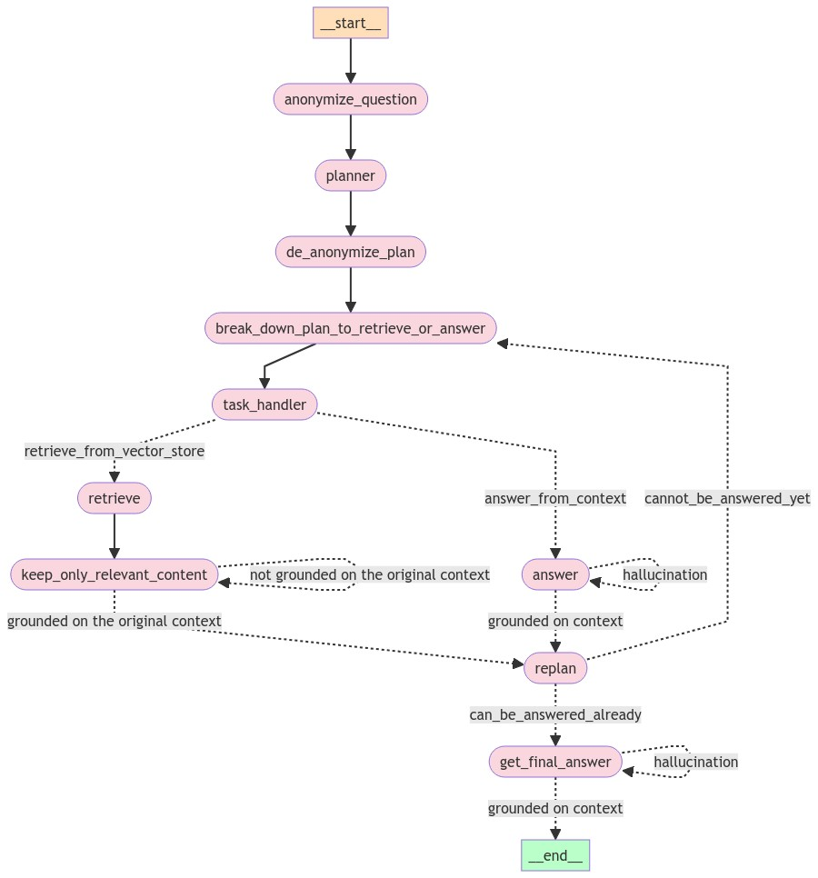

---

# Sophisticated deterministic agent for complex RAG tasks

This repository presents a suggestion for an advanced RAG solution, where there is a need to answer complex questions that cannot be solved by simple retrival based
on semantic similarity. 

### example for such questions:
#### how did the protagonist defeat the villain's assistant?
In order to solve this question, the following steps have to be done:

- Understand who is the protagonist of the plot.
- Understand who is the villain.
- understand who is the villain's assistant.
- serach for confrontation or interaction between the protagonist and the villain.
- deduce the reason that made the protagonist defeat the assistant.


## The general project flow would be: 


- **PDF Loading and Processing:** Load PDF documents and split them into chapters.
- **Text Preprocessing:** Clean and preprocess the text for better summarization and encoding.
- **Summarization:** Generate extensive summaries of each chapter using large language models.
- **Vector Store Encoding:** Encode the book content and chapter summaries into vector stores for efficient retrieval.
- **Define all the different llm based functions for the graph pipline** including planning, retrieval, answering, replanning, content distilation, hallucination checking, etc.
- **Graph-based Workflow:** Utilize a state graph to manage the workflow of tasks.


## For this I suggest the following deterministic agent solution schema:




### Prerequisites

- Python 3.8+

### Installation

1. Clone the repository:
    ```sh
    git clone https://github.com/NirDiamant/RAG-Harry-Potter.git
        ```

2. Install the required Python packages:
    ```sh
    pip install -r requirements.txt
    ```

3. Set up your environment variables:
    Create a `.env` file in the root directory and add your API keys:
    ```
    OPENAI_API_KEY=your_openai_api_key
    GROQ_API_KEY=your_groq_api_key
    ```


## Detailed Explanation

The notebook utilizes large language models (LLMs) such as GPT-3.5-turbo and LLaMA3-70B-8192 to generate summaries and encode the text into vector stores using `FAISS` for efficient retrieval.

### Graph-based Workflow

A `StateGraph` from `langgraph` manages the workflow, including:
- **Anonymizing Questions:** To ensure unbiased planning.
- **Planning Steps:** Generating a step-by-step plan to answer the question.
- **Retrieving and Answering:** Using context to either retrieve relevant information or answer the question.
- **Replanning:** Adjusting the plan based on the gathered context and progress.

### Evaluation

The model's performance is evaluated using `Ragas` metrics like answer correctness, faithfulness, relevancy, recall, and similarity. The results are analyzed to ensure high-quality answers.

## Contributing

Contributions are welcome! Please feel free to submit a pull request or open an issue for any suggestions or improvements.


---